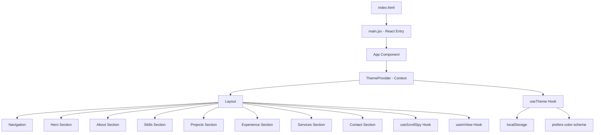

# Design Document: Portfolio Website

## Overview

This document describes the technical design for a modern, minimalist personal portfolio website featuring a black-and-white color scheme, dark/light mode toggle, responsive layout, scroll-triggered animations, and a contact form. The site is a single-page application (SPA) built with React and Vite, styled with CSS Modules and CSS custom properties for theming, and animated using the Intersection Observer API with CSS transitions.

### Key Design Decisions

1. **React + Vite**: Fast build tooling with HMR, tree-shaking, and optimized production builds targeting Lighthouse 90+.
2. **CSS Custom Properties for Theming**: Enables instant theme switching without re-rendering the component tree — just swap a `data-theme` attribute on `<html>`.
3. **CSS Modules**: Scoped styles prevent conflicts while keeping the styling approach lightweight (no runtime CSS-in-JS overhead).
4. **Intersection Observer for Animations**: Native browser API avoids heavy animation libraries, respects `prefers-reduced-motion`, and ensures no duplicate triggers.
5. **Single HTML page with section-based routing**: No client-side router needed. Native scroll behavior with `scroll-behavior: smooth` plus a small scroll utility for finer control.
6. **Plain JavaScript with JSDoc**: No build-time type compilation step. Prop shapes and function signatures are documented with JSDoc comments for editor autocompletion and documentation.

## Architecture



### Layer Breakdown

| Layer | Responsibility |
|-------|---------------|
| **Presentation** | React components rendering HTML with accessibility attributes |
| **Theming** | CSS custom properties controlled via `data-theme` attribute on `<html>` |
| **Animation** | Intersection Observer triggers CSS class additions for transitions |
| **State** | React Context for theme; local component state for form and menu |
| **Persistence** | localStorage for theme preference |

## Components and Interfaces

### Core Components

#### `ThemeProvider`
```javascript
/**
 * @typedef {'dark' | 'light'} Theme
 */

/**
 * @typedef {Object} ThemeContextValue
 * @property {'dark' | 'light'} theme - The current active theme
 * @property {() => void} toggleTheme - Function to switch between dark and light
 */
```
- Wraps the application, provides theme context
- Reads initial theme from: localStorage → OS preference → 'light' fallback
- Persists changes to localStorage (with try/catch for unavailability)
- Sets `data-theme` attribute on `document.documentElement`

#### `Navigation`
```javascript
/**
 * @typedef {Object} SectionLink
 * @property {string} id - The section element ID
 * @property {string} label - Display label for the nav link
 */

/**
 * Navigation component props
 * @typedef {Object} NavigationProps
 * @property {SectionLink[]} sections - Array of section link objects
 * @property {string} activeSection - ID of the currently active section
 */
```
- Fixed position header with section links
- Hamburger menu on mobile (≤767px)
- Highlights active section via `useScrollSpy`
- Mobile overlay with backdrop, closes on link click or outside tap

#### `HeroSection`
```javascript
/**
 * HeroSection component props
 * @typedef {Object} HeroSectionProps
 * @property {string} name - Portfolio owner's name
 * @property {string} tagline - Short description, max 150 chars
 */
```
- Full viewport height (100vh min-height)
- Entry animation on load (fade-in/slide-up within 1000ms)
- Scroll affordance indicator at bottom

#### `AboutSection`
```javascript
/**
 * AboutSection component props
 * @typedef {Object} AboutSectionProps
 * @property {string} biography - Personal biography, 50-2000 chars
 * @property {string} photoUrl - URL of the professional photo
 * @property {string} photoAlt - Alt text for the photo
 */
```
- Side-by-side layout above mobile breakpoint
- Stacked layout at/below mobile breakpoint
- Image fallback on error

#### `SkillsSection`
```javascript
/**
 * @typedef {Object} Skill
 * @property {string} name - Skill name
 * @property {string} [icon] - URL or icon identifier (optional)
 */

/**
 * @typedef {Object} SkillCategory
 * @property {string} name - Category name
 * @property {Skill[]} skills - Array of skills in this category
 */
```
- Grouped by category (minimum 2 categories)
- Staggered reveal animation (50-150ms per item, max 2000ms total)
- Text-only fallback when icon fails to load

#### `ProjectsSection`
```javascript
/**
 * @typedef {Object} Project
 * @property {string} title - Project title, max 100 chars
 * @property {string} description - Project description, max 200 chars, truncated with ellipsis
 * @property {string[]} tags - Technology tags, max 5 items
 * @property {string} [demoUrl] - Live demo link (optional)
 * @property {string} [repoUrl] - Repository link (optional)
 */
```
- Responsive grid: 1 col (mobile), 2 col (tablet), 3 col (desktop)
- Card links to demoUrl if present; no link if neither URL exists
- Technology tags displayed as badges

#### `ExperienceSection`
```javascript
/**
 * @typedef {Object} ExperienceEntry
 * @property {string} role - Job title
 * @property {string} company - Company name
 * @property {string} startDate - Start date string
 * @property {string} endDate - End date string or 'Present'
 * @property {string} description - Role description, max 500 chars
 */
```
- Vertical timeline, newest first
- Fade-in on scroll (within 500ms)
- Single-column on mobile with timeline line on left

#### `ServicesSection`
```javascript
/**
 * @typedef {Object} Service
 * @property {string} title - Service title, max 50 chars
 * @property {string} description - Service description, max 150 chars
 * @property {string} icon - Icon identifier or URL
 */
```
- Grid: 1 col (mobile), 3 col (desktop)
- Fade-in/slide-up animation on scroll (within 600ms)

#### `ContactSection`
```javascript
/**
 * @typedef {Object} ContactFormData
 * @property {string} name - Required, max 100 chars
 * @property {string} email - Required, max 254 chars, valid email format
 * @property {string} message - Required, max 1000 chars
 */

/**
 * @typedef {Object} FormValidationErrors
 * @property {string} [name] - Error message for name field
 * @property {string} [email] - Error message for email field
 * @property {string} [message] - Error message for message field
 */
```
- Client-side validation before submission
- Error messages adjacent to invalid fields
- Success/error state after submission
- Retains form data on failure

### Custom Hooks

#### `useTheme`
```javascript
/**
 * Consumes ThemeProvider context.
 * @returns {ThemeContextValue}
 */
function useTheme() { /* ... */ }
```

#### `useScrollSpy`
```javascript
/**
 * Uses Intersection Observer to track which section is most visible.
 * @param {string[]} sectionIds - Array of section element IDs to observe
 * @returns {string} The ID of the currently active section
 */
function useScrollSpy(sectionIds) { /* ... */ }
```

#### `useInView`
```javascript
/**
 * Triggers when element enters viewport by specified threshold.
 * Sets inView to true once (no repeat triggers).
 * Respects prefers-reduced-motion.
 *
 * @param {IntersectionObserverInit} [options] - Intersection Observer options
 * @returns {{ ref: function, inView: boolean }}
 */
function useInView(options) { /* ... */ }
```

#### `useContactForm`
```javascript
/**
 * Manages contact form state, validation, and submission.
 * @returns {{
 *   formData: ContactFormData,
 *   errors: FormValidationErrors,
 *   status: 'idle' | 'submitting' | 'success' | 'error',
 *   handleChange: (field: string, value: string) => void,
 *   handleSubmit: () => Promise<void>
 * }}
 */
function useContactForm() { /* ... */ }
```

### Utility Functions

#### `validateContactForm`
```javascript
/**
 * Validates contact form data.
 * - name: non-empty, max 100 chars
 * - email: non-empty, valid format (RFC 5322 simplified), max 254 chars
 * - message: non-empty, max 1000 chars
 *
 * @param {ContactFormData} data - The form data to validate
 * @returns {FormValidationErrors} Object with error messages for invalid fields, or empty object if valid
 */
function validateContactForm(data) { /* ... */ }
```

#### `truncateText`
```javascript
/**
 * Truncates text at maxLength and appends ellipsis if exceeded.
 * Returns original text if within limit.
 *
 * @param {string} text - The text to truncate
 * @param {number} maxLength - Maximum allowed length
 * @returns {string}
 */
function truncateText(text, maxLength) { /* ... */ }
```

#### `getInitialTheme`
```javascript
/**
 * Determines the initial theme.
 * - Reads from localStorage first
 * - Falls back to matchMedia('(prefers-color-scheme: dark)')
 * - Defaults to 'light' if neither available
 *
 * @returns {'dark' | 'light'}
 */
function getInitialTheme() { /* ... */ }
```

## Data Models

### Theme State
```javascript
/** @type {'dark' | 'light'} */
let theme;

/** localStorage key */
const THEME_STORAGE_KEY = 'portfolio-theme';
```

### Section Data Structure
```javascript
/**
 * @typedef {Object} SocialLink
 * @property {string} platform - Social media platform name
 * @property {string} url - Profile URL
 * @property {string} ariaLabel - Accessible label for the link
 */

/**
 * @typedef {Object} PortfolioData
 * @property {{ name: string, tagline: string }} hero
 * @property {{ biography: string, photoUrl: string, photoAlt: string }} about
 * @property {SkillCategory[]} skills
 * @property {Project[]} projects
 * @property {ExperienceEntry[]} experience
 * @property {Service[]} services
 * @property {{ socialLinks: SocialLink[] }} contact
 */
```

### CSS Custom Properties (Theming)
```css
:root[data-theme="light"] {
  --color-bg: #ffffff;
  --color-bg-secondary: #f5f5f5;
  --color-text: #000000;
  --color-text-secondary: #1a1a1a;
  --color-border: #e0e0e0;
  --color-accent: #333333;
}

:root[data-theme="dark"] {
  --color-bg: #000000;
  --color-bg-secondary: #1a1a1a;
  --color-text: #ffffff;
  --color-text-secondary: #f0f0f0;
  --color-border: #333333;
  --color-accent: #cccccc;
}
```

### Responsive Breakpoints
```css
/* Mobile: ≤767px (default) */
/* Tablet: 768px - 1023px */
@media (min-width: 768px) { /* tablet styles */ }
/* Desktop: ≥1024px */
@media (min-width: 1024px) { /* desktop styles */ }
/* Max content width */
.container { max-width: 1440px; margin: 0 auto; }
```

## Correctness Properties

*A property is a characteristic or behavior that should hold true across all valid executions of a system — essentially, a formal statement about what the system should do. Properties serve as the bridge between human-readable specifications and machine-verifiable correctness guarantees.*

### Property 1: Text truncation preserves content or truncates correctly

*For any* string and any positive maximum length, calling `truncateText(text, maxLength)` should either return the original string unchanged (if `text.length <= maxLength`) or return a string of exactly `maxLength` characters ending with "…" (ellipsis), where the prefix before the ellipsis matches the start of the original string.

**Validates: Requirements 3.2, 6.1**

### Property 2: Experience entries render in chronological order (newest first)

*For any* list of experience entries with valid start dates, the rendered output should display entries in descending chronological order — the entry with the most recent start date appears first, and the entry with the earliest start date appears last.

**Validates: Requirements 7.1**

### Property 3: Experience entry rendering includes all required fields

*For any* valid experience entry (with role, company, startDate, endDate, and description), the rendered output should contain all five fields visible in the DOM.

**Validates: Requirements 7.2**

### Property 4: Valid contact form data passes validation

*For any* form input where name is non-empty and ≤100 characters, email is a valid email format and ≤254 characters, and message is non-empty and ≤1000 characters, `validateContactForm(data)` should return an empty errors object (no validation failures).

**Validates: Requirements 9.1, 9.3**

### Property 5: Invalid contact form data produces specific errors

*For any* form input where at least one field is invalid (name is empty or >100 chars, email is empty/invalid format or >254 chars, message is empty or >1000 chars), `validateContactForm(data)` should return a non-empty errors object with error messages only for the invalid fields — valid fields should have no associated error.

**Validates: Requirements 9.4**

### Property 6: Animation triggers exactly once per element

*For any* sequence of Intersection Observer callbacks on a single element (alternating between visible and not-visible), the `useInView` hook should set `inView` to `true` exactly once and never reset it to `false`, ensuring the animation class is added only once regardless of how many times the element enters/exits the viewport.

**Validates: Requirements 11.3, 11.5**

## Error Handling

### Image Loading Failures

| Component | Failure | Recovery |
|-----------|---------|----------|
| AboutSection | Photo fails to load | `onError` handler swaps to placeholder silhouette SVG |
| SkillsSection | Skill icon fails to load | `onError` handler hides icon, shows text-only badge |
| ServicesSection | Service icon fails to load | Graceful degradation to text label |

### Form Submission Errors

| Error Type | Handling |
|------------|----------|
| Validation failure | Display inline error messages per field; form data preserved |
| Network error | Display banner error message: "Submission failed. Please try again."; all form data preserved |
| Server error (5xx) | Same as network error — display error, retain data |

### Theme Persistence Errors

| Error Type | Handling |
|------------|----------|
| localStorage unavailable | `try/catch` around read/write; fall back to in-memory state for session |
| Corrupted stored value | Ignore stored value, apply OS preference → 'light' fallback |
| `matchMedia` unavailable | Skip OS preference detection, default to 'light' |

### Animation Errors

| Error Type | Handling |
|------------|----------|
| IntersectionObserver unsupported | Feature detection; show all content without animations |
| `prefers-reduced-motion: reduce` | Skip all CSS transitions and transforms; content renders immediately |

## Testing Strategy

### Testing Stack

- **Unit Testing**: Vitest (fast, Vite-native)
- **Component Testing**: React Testing Library with Vitest
- **Property-Based Testing**: fast-check (JavaScript PBT library, integrates with Vitest)
- **E2E Testing**: Playwright (for Lighthouse audits and visual regression)
- **Accessibility Testing**: axe-core via @axe-core/react in dev, Lighthouse for CI

### Unit Tests (Example-Based)

Focus areas:
- `getInitialTheme` — all fallback scenarios (localStorage present, OS preference, defaults)
- Theme toggle context — verify `data-theme` attribute changes
- Navigation — active section highlighting, hamburger toggle state
- Contact form — specific valid/invalid examples, submission flow
- Responsive breakpoint behavior (mocked viewport)

### Property-Based Tests

Using **fast-check** with Vitest. Minimum **100 iterations** per property.

| Property | Test Target | Generator Strategy |
|----------|-------------|-------------------|
| Property 1: Text truncation | `truncateText` | `fc.string()` + `fc.integer({min: 1, max: 500})` for maxLength |
| Property 2: Timeline ordering | Sort/render logic | `fc.array(experienceEntryArbitrary)` with random dates |
| Property 3: Entry completeness | Experience rendering | `fc.record({role, company, startDate, endDate, description})` |
| Property 4: Valid form passes | `validateContactForm` | Custom generator for valid name/email/message within constraints |
| Property 5: Invalid form errors | `validateContactForm` | Generator mixing valid/invalid fields with at least one invalid |
| Property 6: Animation once | `useInView` hook | `fc.array(fc.boolean())` representing intersection states |

**Tag format**: Each property test will include a comment:
```javascript
// Feature: portfolio-website, Property {N}: {property_text}
```

### Integration / E2E Tests

- Lighthouse CI in GitHub Actions (performance ≥90, accessibility ≥90)
- Scroll behavior validation across sections
- Form submission with mocked API endpoint
- Theme persistence across page reloads

### Visual Regression Tests

- Screenshot comparison at mobile (375px), tablet (768px), and desktop (1440px) viewports
- Dark mode and light mode variants
- Animation states (before/after scroll trigger)
